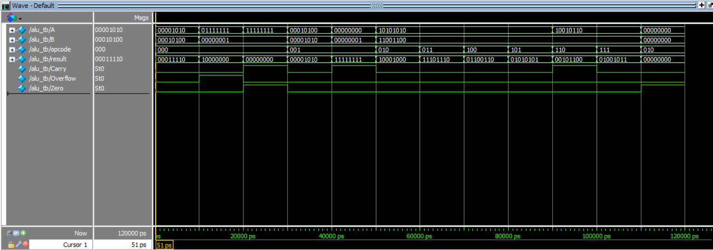

# 8-bit Arithmetic Logic Unit (ALU) in Verilog HDL

## Overview

This project implements an **8-bit Arithmetic Logic Unit (ALU)** using **Verilog HDL**. The ALU performs arithmetic, logical, and shift operations based on a 3-bit opcode while generating **Zero**, **Carry**, and **Overflow** status flags. The design was verified using a comprehensive Verilog testbench in **ModelSim**.

---

## Features

- 8-bit combinational ALU
- Arithmetic operations
  - Addition
  - Subtraction
- Logical operations
  - AND
  - OR
  - XOR
  - NOT
- Shift operations
  - Logical Left Shift
  - Logical Right Shift
- Status Flags
  - Zero Flag
  - Carry Flag
  - Overflow Flag
- Verified using ModelSim simulation

---

## Supported Operations

| Opcode | Operation |
|:------:|-----------|
| 000 | Addition (A + B) |
| 001 | Subtraction (A - B) |
| 010 | Bitwise AND |
| 011 | Bitwise OR |
| 100 | Bitwise XOR |
| 101 | Bitwise NOT (A) |
| 110 | Left Shift |
| 111 | Right Shift |

---

## Inputs and Outputs

### Inputs

| Signal | Width | Description |
|--------|------:|-------------|
| A | 8-bit | Operand A |
| B | 8-bit | Operand B |
| opcode | 3-bit | Operation Select |

### Outputs

| Signal | Width | Description |
|--------|------:|-------------|
| result | 8-bit | ALU Output |
| Zero | 1-bit | High when result is zero |
| Carry | 1-bit | Carry/Borrow flag |
| Overflow | 1-bit | Signed overflow flag |

---

## Block Diagram


---

## Simulation Waveform

The ALU functionality was verified using a Verilog testbench in ModelSim.



---
## RTL Schematic

The synthesized RTL generated by Intel Quartus Prime demonstrates the hardware implementation of the ALU, including arithmetic logic, multiplexers for opcode selection, and status flag generation.


---

## Project Files

```
8-bit-ALU-Verilog/
│
├── alu.v
├── tb_alu.v
├── README.md
├── .gitignore
├── alu_waveform.png
└── block_diagram.png
```

---

## Tools Used

- Verilog HDL
- Intel ModelSim
- Intel Quartus Prime
- Git & GitHub

---

## How to Simulate

Compile the design and testbench:

```text
vlog alu.v
vlog tb_alu.v
```

Start the simulation:

```text
vsim alu_tb
```

Run the simulation:

```text
run -all
```

---

## Future Improvements

- Parameterizable ALU width (N-bit)
- Additional arithmetic operations (Multiply, Divide)
- Rotate Left / Rotate Right operations
- Signed and Unsigned comparison operations
- Synthesis and FPGA implementation on Intel FPGA boards

---

## Author

**Aryan Patgar**

B.Tech Electronics and Communication Engineering  
National Institute of Technology Karnataka (NITK), Surathkal

GitHub: https://github.com/hmm-ingenious
